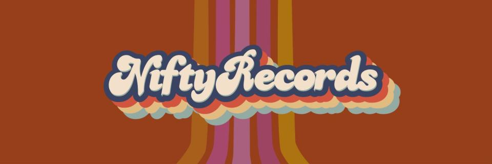

  
    
  
Ahoy hoy! This is [@entropygun](https://discord.gg/4FgUScNF23) here on the [@NiftyRecordsNFT](https://niftyrecordsnft.com) community discord server running with an idea I tossed out on the `#ideas channel` and I have a bad habit of letting my big mouth get me in trouble so here I am hoping to not screw this up and if works I’ll be minting some artifacts to commemorate this event.

I'm going to be sharing some songs here that make up the sound track of my life and I think you just might dig them too.  So we're gonna kick things off tonight with a mic check of some vintage Tribe Called Quest, can I kick it? Yes I can. Here's _**Buggin Out**_, let's goooo!🚀

...(_played first three tracks of this YouTube Playlist:_)  
<!-- more -->  

<iframe width="560" height="315" src="https://www.youtube.com/embed/videoseries?list=PLfvyalrCJ86rLf8wrft2QxKL1_j3kZQqC" title="YouTube video player" frameborder="0" allow="accelerometer; autoplay; clipboard-write; encrypted-media; gyroscope; picture-in-picture" allowfullscreen></iframe>
  
**Track 1:** Our first track was **Buggin Out by A Tribe Called Quest** from the album The Low End Theory that by the way was released when I started high school in 1991 and you know I was real quick to add that CD to my BMG Music Club 10 discs for a penny order the first chance that I got.  Anyone remember the old BMG and Columbia Music Clubs that got Americans hooked on CDs?... smh you kids these days have no idea what we had to put up with to get music... it was like having to walk to school in the snow uphill both ways... 12 CDs for a penny plus shipping and handling followed by years of getting gouged locked in a predatory contract.  Oh music industry… why are you like this???

**Track 2:** Ok after that we heard **Inside Your Arms by Ambrosia** off of the Global Underground 007: New York Paul Oakenfold disc2 compilation thing. This track is one that i was sad to learn is not on Spotify... and it seems to have a murky past.  I didn't have time to dig into but if any music historians are listening they might find out something interesting... also is that a sample of Ice-T rapping 'bang nine automatic'? It sure sounds like his sweet gravely voice.  

Anyways, the Inside Your Arms track really speaks to me and this moment...beacause I don't know what I'm doing but doing it anyways.  And also the gun violence in the US is at an all time high... but it's been like that since I can remember more than 40 years now and that makes me sad and I'm gonna pause for a brief moment of silence in memory of all those lost to senseless violence - - - - - - -

**Track 3:** Phew ok, the third track you heard was **Say Yes by Wax Tailor featuring ASM**... because well tonight is all about saying yes to all the artists that be keeping it real, yes, yes, y'all

ok lets get back to some jams  

...(_played next three tracks)

  
Now a word from our sponsors, psyche we don't have any sponsors, all we have is the stoke with this nascent little community here at [NiftyRecordsNFT](https://www.niftyrecordsnft.com), tell your friends to come check it out

**Track 6:** You just heard **Sun is Shing by Bob Marley vs Funkstar De Luxe (Funkstars club mix)** because well I'm a rainbow too! Also fun fact I don't remember when I picked up this track but it was back in the Napster peer-to-peer sharing era where we all just carelessly shared our collections and downloaded every mp3 we could find to burn onto CD-Roms... holy moly that was a lot of effort, but it is fitting that the block-chain was built off the ruins of those early peer-to-peer networks, they don't call it that anymore, these days they're calling it decentralized, but it's the same thing

**Track 5:** Before that you heard **Music Saved my Life by Cevin Fisher**, the Peter Heller mix played byJohn Digweed on some other Global Underground disc2 compilation thing because well I gotta thank god for the music... lol and I don't even believe in god, nevertheless I do thank him for the music on a regular basis... but is god really a him?🤔 prolly not... anyways...

**Track 4:** Ok if you're still listening or you're looking forward to seeing me in hell for that last comment, let me tell you that before Digweed we heard the song **I Wanna Get Better by the Bleachers**, because well yea, I'm prolly going to hell, but I'm standing at the overpass screaming at the cars that I wanna get better, and that song has gotten me through a lot of really hard times, if it wasn't for the music I don't know what we'd do.  Also it was really cool to find that official video includes the lyrics overlay. And if you really want to go on a rollercoaster ride of all the feels, check out the comments on the videos... 

ok let's back to the music

...(_played next three tracks_)  

  
Alrighty if you're still here or just joining, this is entropygun and thanks for listening to my very first live bigmood-sesshin here on the NiftyRecords community Discord server.  

**Track 9:** You just heard **Stereo Hearts by Gym Class Heros featuring Adam Levine**. This track really hits me right where it counts and the video doesn't disappoint either...  _All I ask is that you don't get mad at me, when you gotta purchase mad D batteries_! Haha

**Track 8:** Before that was **Kiss the Sky by Shawn Lee's Ping Pong Orchestra**.  Oh man this song... what can I say? A mood feaux sheaux! whatever you do, don't forget it's not too late to keep the world from dying , and it's not too late to spread the love you have... (_but it is too late too apologize tho_)

**Track 7:** And before that was **Same Song by the Digital Underground** off their 1991 album This Is An EP Release. This is another classic from the annals of hip hop history that I'm pretty sure I picked up off of the BMG Music Club catalog for a penny when I was in high school.  The album cover features a Customer IQ Quiz and art drawn up by Shock G himself and the real fun fact is that this song launched Tupac Shakur's journey into stardom... go back later and watch the video again to hear him clown around on the last verse at the t=2min mark

but right now let’s listen to one more jam before we wrap things up

...(_played next two tracks_)  

**Track 10:** That was **Frontier Psychiatry by The Avalanches** and yea it feels like I just woke up from a nap having the strangest dream. But really, therapy is no joke. If you’re struggling with your mental or behavioral health, please know that you are not alone and help is out there as long as you don’t ever give up. Start by reaching out to your local community family and friends, but if they are failing you, shoot me a direct message here or on the bird app @entropygun

**Track 11:** And with that I’m going to send us off with a very special track that I had forgotten about a long time ago but just stumbled back across it while working on this set list.  The song is titled **Heal The Separation by The Shamen** off their 1995 release called Axis Mutasis. This is entropygun signing off until next time, always always remember that we _are stronger than we can imagine_, _but somehow the both us were wrong_

---

**SOME OF THE THINGS THAT HELPED KICK OFF THIS INAUGRAL SESSHIN:**  
another stormy night in Atlanta; Nifty Records NFT community on Discord; Monroe; DayDream; BabyLove; Ginger's reluctant and impatient Discord tech support - after all that just needed to disable the noise supression; Rasklfish; Minabug; Rufferito Bandito; CoachMike; SeanMillsArtist; theMakerStation, Dr. Shook, Hannah the intern; Viktor the volunteer; Dōgen; Budia; Saint Expeditus; random artists on the internet (_that are like faint flickering candles burning a little light into our lives_); juggling half a dozen music streaming services's free trial premium subscriptions (_only to find each missing a critical track in their own unique way_); a highly curated Pandora Music station (_that can not be replicated, it's like non fungible or something_); #beingbret's friends&family group chat updates on his post-surgery recovery; pints of cold brew coffee from Apotheos Roastery (_their Adventurer pecan flavored stuff_); Nespresso original-line Shanghai Lungo pours (_with a dash of hazelnut flavored almond milk_); kitchen-ground local roasted coffee beans in the moka pot; Baby Love's epic ginger bread cookies; LaCroix Pamplemousse fizzy water for hipsters; Sanpellegrino Aranciata Rosa (_it's fizzy blood orange!_); the 'dead week' between Christmas and New Year's; unlimited PTO for that elusive work-life-balance; mid-life crises; mental health days; self care; talking to myself as I try to figure it out; A Huge Ever Growing Pulsating Brain That Rules from the Centre of the Ultraworld; getting lost in my Relanote Graph; and Seeking refuge in the Buddha, the Dahrma, and the Sangha 🙏  
[< YouTube Playlist for bigmood sesshins001 >](https://youtube.com/playlist?list=PLfvyalrCJ86rLf8wrft2QxKL1_j3kZQqC) 
